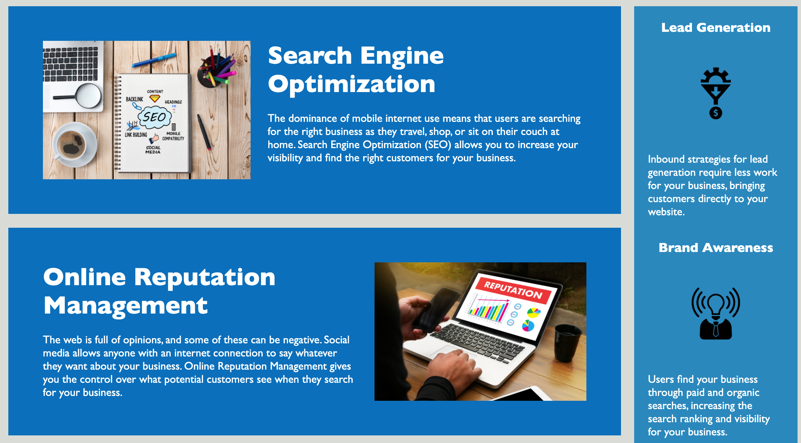

# Accessibility In A Modern Marketing Website
## Description
- An exercise in cleaning up code for accessibility, including semantic tags, alt-text for images, structure, and organization.
- Practice commenting on code.
- Learn what code makes for an accessible, readable, and user-friendly web page.
## Table of Contents
- [Installation](#installation)
- [Usage](#usage)
- [Credits](#credits)
- [License](#license)
## Installation
This web page was edited in VS Code and deployed on GitHub pages.
## Usage
Example of accessible web page.
    
## Credits
UCSD Web Design Bootcamp 2021
## License
None.
